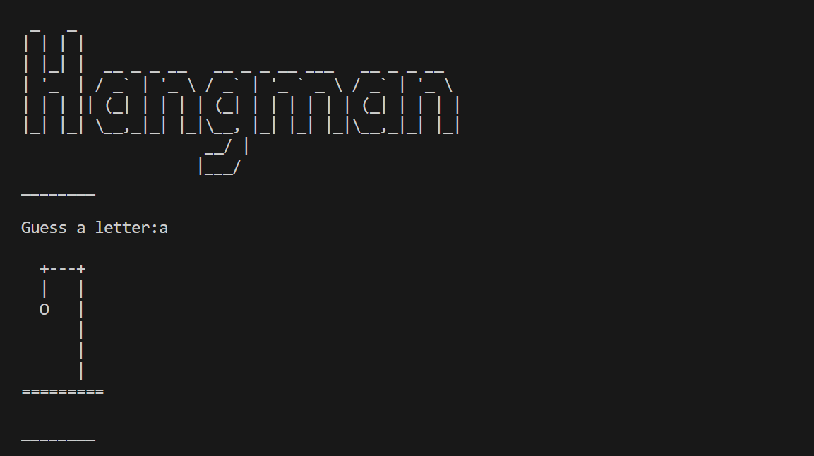
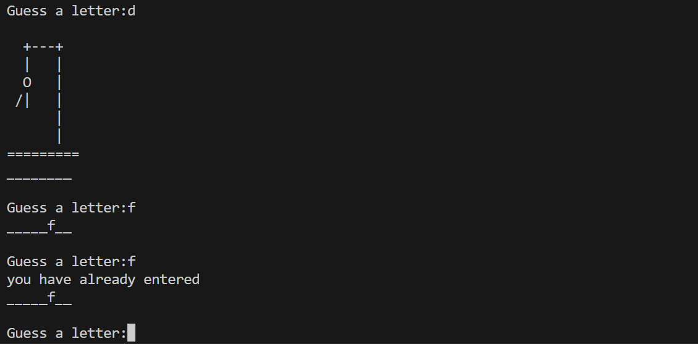
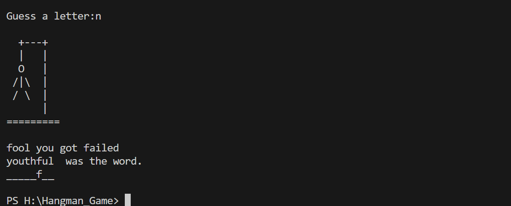

# Hangman Game

Hangman is a classic word-guessing game where one player thinks of a word and the other player tries to guess it letter by letter. The game continues until the guesser either guesses the word correctly or makes too many incorrect guesses.

## Features

- Single-player mode
- Multiplayer mode (coming soon)
- A wide range of words to guess
- Keep track of your score
- User-friendly interface

## How to Play

1. Start the game by running the program.
2. Select the game mode (single-player or multiplayer).
3. In single-player mode, the computer will choose a random word for you to guess.
4. Guess letters one by one. You can keep track of your incorrect guesses.
5. Keep guessing until you either guess the word correctly or run out of attempts.
6. In multiplayer mode, one player thinks of a word and the other player guesses it.
7. Take turns and have fun!

